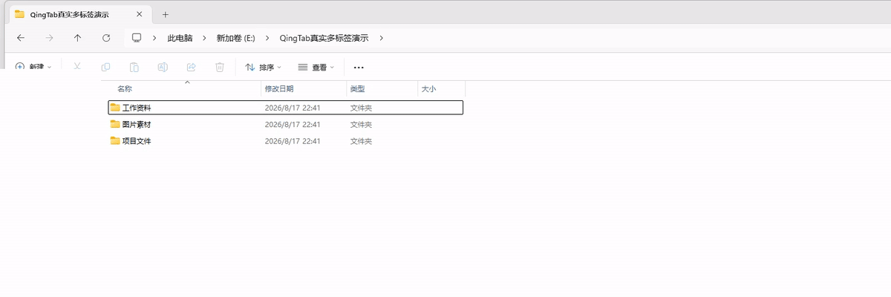

# 轻页 QingTab

轻页是一个面向 Windows 11 的中文托盘小工具：把“普通打开文件夹”直接送进现有文件资源管理器窗口的新标签页。

当前候选版本：`0.2.6 Lite`

## 真实效果演示

普通双击文件夹，不先弹出一个新窗口，直接进入当前文件资源管理器的新标签：


连续打开多个文件夹时，可以从一个标签自然增加到多个标签：



以上均为 Windows 11 文件资源管理器的实际运行录屏，仅裁剪画面并遮挡了无关侧栏，没有重画或伪造界面。0.2.6 Lite 延续相同的直接打开流程。

## 这一版解决了什么

### v0.2.6 Lite：把已撤回的视觉实验从正式 EXE 中真正移除

0.2.6 保持 0.2.5 Lite 已验证的外部接口和响应顺序不变：托盘、请求队列和 IPC 仍只调用同一个 `ExplorerWatcher`，它只负责启用、报告状态、打开路径和释放。内部正式实现只保留响应优先的新标签命令、Shell 登记、精确导航结果分类与 COM 生命周期；整页遮罩、UIA 标签快照、双身份恢复和后台标签切换不再进入驻留程序。

研究源码仍保留在仓库，并由测试项目单独编译，因此历史安全决策和实验检查没有丢失；生产项目通过明确的编译清单排除它们，同时删除 `UIAutomationClient / UIAutomationTypes / WindowsBase` 引用。

后台结果：Release 构建 `0` 警告、`0` 错误；206 项行为检查连续 5 轮全部通过。EXE 从 0.2.5 RC2 的 `204800` 字节降为 `116736` 字节，减少 `88064` 字节、约 `43%`。程序集依赖检查确认正式 EXE 已不再引用任何 UIAutomation 程序集；请求队列中只供已撤回视觉流程使用的重复点击信号、outstanding 字典和完成回调也已删除。用户随后完成日常操作验收：没有发现新的功能错误，响应与 0.2.4/0.2.5 Lite 基本相同；高标签数或连续打开时仍可能短暂看到 Explorer 的“此电脑”默认页，这是当前已知限制，不再用遮罩或额外标签切换掩盖。

### v0.2.5 Lite 当前候选（开发中）：恢复 0.2.4 的直接、响应优先路径

早期 0.2.5 为了完全遮住新标签内部短暂出现的“此电脑”，先后尝试了“恢复旧标签后后台导航”以及整页加载提示。前者在高标签数现场样本中达到约 `4.66 秒`并多做两次标签切换；后者虽然能覆盖默认页像素，却让等待更显眼，并增加遮罩不可用、用户接管和目标未就绪等分支。用户 A/B 明确认定两种体验都不如 0.2.4，因此均不再作为默认路径。

Lite 候选恢复 0.2.4 的关键顺序：立即向目标 Explorer 发送新标签命令，认领对应 Shell 标签后直接提交目标路径，导航调用返回后立即结束请求。默认路径不创建 UIA 快照、不显示整页遮罩或“正在打开…”，不恢复旧标签，也不等待 `Busy / ReadyState` 完全就绪。Explorer 自己可能短暂绘制默认页，但轻页不再为隐藏它而额外阻塞用户。

同一“窗口 + 路径”只在 `300 ms` 内去重，用来过滤一次点击引发的 Shell 抖动；超过该窗口的再次点击会按 FIFO 保留，即使前一次仍在等待 Explorer，也不会再被静默吞掉。队列仍有固定容量并串行处理，不会产生无界 COM 并发；IPC 把真正的短时 `Duplicate` 当作已接收，不会触发额外顶层窗口回退。

Shell 登记继续复用缓存的动态 `ShellWindows` 集合、倒序精确匹配和 `2–4 秒`自适应预算；整个请求仍受 `15 秒`总预算约束。短时重复请求合并、导航结果分类以及 Shell 生命周期保护继续保留，但不得在成功热路径增加视觉层或完整页面就绪等待。

当前验证：Release 编译 `0` 警告、`0` 错误，`206` 项行为检查通过。与稳定版 0.2.4 的同窗口、同 E 盘五轮 A/B 已完成：0.2.5 Lite 的目标匹配中位数约 `1718 ms`，0.2.4 约 `1661 ms`；默认页可见中位数分别约 `1285 / 1221 ms`。这说明 Lite 已消除早期 0.2.5 遮罩/恢复旧标签造成的额外卡顿，整体回到 0.2.4 水平，但没有伪称消除了 Explorer 自己的默认页。隔离退出测试也已通过：退出后驻留进程归零，Folder 覆盖和轻页所有权记录消失，Windows 恢复原生打开方式；正式 0.2.4 注册随后已精确恢复。

主要安全边界：

- 标签创建结果不确定时不再额外打开顶层窗口，避免“空白标签 + 重复窗口”；
- 导航一旦可能已被 Explorer 接受，就不再误关标签或重复回退；
- 用户在等待期间操作键鼠、切换窗口或接管标签后，自动激活与窗口回退会永久取消；
- 关闭功能或退出程序与建标签命令使用同一提交门：关闭动作返回后，不会再迟到发送建标签命令；
- Shell COM 连接按操作生命周期延迟退役，避免正在处理请求时释放共享对象。

早期候选完成的高标签数、重复请求和断连证据保留为历史资料。0.2.6 Lite 不以“完全消除 Explorer 内部过渡帧”为发布目标；它的发布边界是：不创建中转顶层窗口、不增加视觉遮罩和额外标签切换、失败时不误关标签，并明确披露上述默认页限制。

### 1. v0.2.4：减少偶发卡顿，并把失败说清楚

v0.2.4 不改变“直接创建标签、绝不先开临时窗口”的主结构，重点缩短冷启动和异常等待，并让托盘状态与真实运行状态一致：

- 启动短命令会先探测驻留实例是“不存在、启动中、已就绪”，没有实例时不再白等旧管道超时；
- 命名管道增加 `Accepted / Duplicate / Rejected` 确认应答，连接和等待确认共用一份有界超时；驻留队列拒绝时，短命令才能明确走正常开窗回退；
- 打开结果不再只有笼统的成功/失败，而会区分目标窗口不可用、标签句柄超时、Shell 登记超时、Explorer 忙碌、Shell 断连和导航失败；
- 只对 `RPC_E_CALL_REJECTED` 与 `RPC_E_SERVERCALL_RETRYLATER` 做 `25 / 75 / 150 ms` 的短促有界重试，未知 COM 错误不会盲目重试；
- Shell 登记等待会参考最近 20 次成功样本，在 `2–4 秒`之间自调；冷启动采用 `3 秒`安全预算，整个请求仍受原有 `15 秒`总预算约束；
- 诊断报告增加 P50/P95，并显示每阶段“本段耗时 + 累计耗时”，还会分开记录导航开始和 COM 返回；
- 开关关闭后立即停止 Explorer 进程跟踪并释放 Shell COM 对象；托盘会区分关闭、连接中、已就绪、重连中和暂不可用；
- 退出拆分为“停用新标签接管并退出”和“仅退出驻留（下次打开会重启）”，首次运行会明确询问是否开启主功能；
- 标签路径失败时仍保证正常开窗，并用 30 秒限频提示说明本次发生了回退。

本机 v0.2.4 的 `E:\` 实机样本为 `2276 / 1237 / 1274 / 1303 / 1296 ms`，5/5 都进入既有 Explorer 窗口的全新标签，测试期间没有创建或显示新的 Explorer 顶层窗口；完全没有驻留进程时的冷启动样本为 `1933 ms`。这些结果说明轻页自身的冷启动与失败路径已更可控，但 Explorer 创建视图、加载图标和绘制文件列表仍是主要可见等待。

### 2. v0.2.3：E 盘延迟专项诊断与轻量优化

v0.2.3 针对盘符根目录的等待做了真实前台、端到端测试，没有增加按键模拟、地址栏自动化、Explorer 注入或新的全局钩子：

- 常驻复用动态 `ShellWindows` 集合，不再在每次 5–40 ms 轮询时重新取得一个 COM 集合；
- 新标签通常登记在集合末尾，因此从最后一项向前查找，同时仍逐项核对目标标签 HWND；顺序变化只会稍慢，不会匹配错误；
- 只在用户没有切到第三方应用时重新激活目标 Explorer，避免等待期间抢回焦点；
- 仅对 `RPC_E_DISCONNECTED`、`CO_E_OBJNOTCONNECTED` 等永久断连重建 Shell 连接，普通瞬时 COM 拒绝仍按原逻辑重试；
- 性能测试器现在可以直接测试 `E:\` 等真实目录、正确转义尾随反斜杠，并把结构零闪烁与时延阈值分开判定。

本机的 E 盘是 Samsung SSD 980 NVMe，根目录 230 项，PowerShell 完整枚举约 `79 ms`，所以本次等待不是机械硬盘或盘符读取本身造成的。分段测量中，新标签 HWND 通常在 `5–29 ms` 出现，Shell 登记常见约 `363–538 ms`；热态直接导航调用约 `8–44 ms`，之后主要时间花在 Explorer 自己创建视图、加载图标/属性处理器并绘制 230 个项目。清洁前台环境下，v0.2.3 的一组 `E:\` 冷/热端到端样本为 `1861 / 1069 / 1070 / 1053 / 1046 ms`，全部没有创建新的 Explorer 顶层窗口。Explorer 负载变化后，同环境 v0.2.2 与 v0.2.3 都会波动到约 `1.8–2.3 秒`，说明剩余波动主要在 Explorer，不应把它宣传成轻页能够消除的“零延迟”。

v0.2.2 已完成的稳定性改进继续保留：

- 收到请求的瞬间就记录当时位于前台的 Explorer 窗口，排队后仍优先回到这扇窗口，减少标签跑错窗口；
- 使用容量为 10 的 FIFO 请求队列，300 ms 内同一路径、同一目标窗口的重复请求只处理一次；
- 队列满时对命名管道施加背压，等待旧请求腾出位置，不再向 UI 线程无限追加旁路任务；
- 每个请求从收到开始共用一份 15 秒单调时钟预算，排队、等待 Explorer、创建标签和等待 Shell 登记都计入总预算；
- 直接标签路径超时或不可用时仍回退到 Windows 正常开窗，优先保证文件夹可以访问；
- 每次只查询当前需要的新标签，及时释放其余 Shell COM 对象，并采用前 250 ms 快速、之后较慢的自适应轮询；
- 冷启动增加明确的“驻留进程已就绪”握手，后台 WinExe 使用隐藏 Shell 启动，不继承调用方控制台管道。

本机 10 轮热路径全部通过，平均找到目标标签约 `2.62 秒`；最终三轮回归为 `2.91–4.28 秒`。冷启动最终回归约 `5.61 秒`，相同环境下 v0.2.1 的历史样本约为 `9.96 秒`。这些数字只用于比较本次测试机，不是对所有电脑的延迟承诺。

### 3. 普通打开文件夹：不创建中转窗口，也不再增加视觉遮罩

旧方案的顺序是“先出现新窗口 → 隐藏 → 搬到标签页 → 关闭新窗口”。只要新窗口已经创建，就可能闪一下、卡一下。早期 0.2.5 又尝试用加载遮罩隐藏 Explorer 新标签的默认页，但实机结果表明，遮罩会把等待变得更明显，并增加失败分支和卡顿感，因此 Lite 路径已经撤回它。

当前“普通打开文件夹 → 新标签”的顺序是：

1. Windows 的普通 Folder `open` 请求先进入轻页；
2. 轻页立即在已有 Explorer 窗口中请求一个新标签，不创建待转换的顶层窗口；
3. Shell 注册该标签后，轻页按目标窗口和标签句柄精确匹配对应 COM 项；
4. 轻页把目标路径提交给该标签；导航调用被 Explorer 接受后立即结束本次请求，不再等待整页渲染，也不切回旧标签。

因此它解决的是“中转窗口闪烁”，不是承诺 Explorer 内部绝对没有过渡帧。Windows 没有公开稳定的“直接创建并同时指定目标路径的 Explorer 标签”接口，新标签初始化期间仍可能短暂绘制“此电脑”；0.2.6 选择不再用遮罩、额外切换或长等待去掩盖它，优先保证鼠标可用、操作直接和失败路径简单。

### 4. 保留 v0.2.1 的盘符根目录修复

`E:\` 这种以反斜杠结尾的盘符根目录放进带引号的 Windows 命令行后，可能被解析成非法的 `E:"`，于是 Explorer 报“无法找到 `file:///E:%22`”。

v0.2.1 会在程序入口修复这种系统参数解析痕迹，并在失败回退时使用正确的 Windows 参数转义。`E:\` 连续 3 次实测均成功进入新标签，没有报错，也没有新顶层窗口。

### 5. 保留“在新窗口中打开”的原生含义

v0.2.0 还保留了旧版的顶层窗口监视器。它无法判断一扇新窗口是普通打开产生的，还是用户明确点了“在新窗口中打开”，因此会把后者也隐藏并收进标签页。

v0.2.1 已彻底移除这套监视、隐藏和搬运逻辑，也不再注册 WinEvent 窗口钩子。因此：

- “在新窗口中打开”会真正保留独立窗口；
- “在新标签页中打开”完全使用 Windows 原生行为；
- Win + E、任务栏 Explorer、显式 `explorer.exe` 保持 Windows 原生行为；
- 轻页只处理托盘开关所写明的“普通打开文件夹”。

## 文件夹选项应该怎么设置

若希望在 Explorer 内容区双击文件夹时也进入新标签，请保留：

`文件夹选项 → 常规 → 浏览文件夹 → 在不同窗口中打开不同的文件夹`

原因是：

- 选“同一窗口”时，Explorer 直接在当前标签内部导航，不会发出新的 Folder `open` 请求，轻页没有机会接管；
- 选“不同窗口”时，Windows 原本准备发出新窗口打开请求，轻页会在窗口创建前接住它，改为现有窗口的新标签。

这个设置不会破坏右键菜单的“在新窗口中打开”。v0.2.1 已明确把该原生动词排除在轻页之外。

## 各种入口的最终行为

| 操作 | 开启新标签接管后的行为 |
|---|---|
| 内容区双击文件夹，且文件夹选项为“不同窗口” | 现有窗口的新标签；成功路径无临时窗口 |
| 桌面文件夹或其他程序发出的普通“打开文件夹” | 现有窗口的新标签；成功路径无临时窗口 |
| 盘符根目录，例如 `E:\` | 现有窗口的新标签；已修复 `%22` 弹窗 |
| 左侧导航栏左键 | Windows 原生：当前标签切换位置 |
| 左侧导航栏中键 | Windows 原生行为 |
| 右键“在新标签页中打开” | Windows 原生行为 |
| 右键“在新窗口中打开” | Windows 原生：真正的新窗口 |
| Win + E、任务栏 Explorer、显式 `explorer.exe` | Windows 原生行为，不做窗口转标签 |
| 当前没有任何 Explorer 窗口 | 正常打开第一扇窗口；有宿主后才可直接增加标签 |

之前所说的“主版本不拦截左键，保留中键原生操作”，只指**左侧导航栏**。它不表示普通双击文件夹不处理；普通 Folder `open` 正是轻页的主功能。

## 安装与升级

轻页是便携版，不需要管理员权限。

1. 解压完整 ZIP 到一个不会随意移动的目录；
2. 若旧版正在运行，先从托盘退出旧版；
3. 运行 `QingTab.exe`；
4. 首次运行会询问是否立即开启“普通打开文件夹 → 新标签”；之后也可随时从托盘切换；
5. 按需切换“开机自动启动”。

轻页不会静默接管 Folder 普通打开命令；首次运行必须由你明确选择，之后每次修改都通过托盘开关完成。

建议不要把新版文件直接覆盖进仍在运行的旧版目录。升级时解压到新的稳定目录，再退出旧版并启动新版最稳妥。

## 托盘开关

托盘右键菜单提供：

- `普通打开文件夹 → 新标签`；
- `开机自动启动`；
- `复制诊断信息`；
- `使用说明`；
- `关于与开源许可`；
- `退出`。

关闭新标签开关后，轻页会进行所有权校验，再恢复 Windows 原来的普通文件夹打开方式；同时停止 Explorer 进程跟踪并释放 Shell COM 对象。开关关闭时，轻页不接管任何 Explorer 打开动作。

“退出”会先进行所有权校验并恢复 Windows 原来的文件夹打开方式，成功后再结束驻留。因此退出后再次打开文件夹不会把轻页静默拉起；若安全恢复失败，轻页会明确提示并保持运行，不会伪装成已经完全退出。`开机自动启动`仍是独立偏好，需要永久关闭时可先取消该复选框。

“复制诊断信息”会复制最近 20 次请求的 P50/P95、分阶段增量/累计耗时、稳定失败码、结果、版本、Windows 版本、内存和句柄数。它只记录“本地文件夹、磁盘根目录、UNC 网络文件夹、Shell 位置”等类别，不保存或复制完整文件夹路径。

## 失败回退

如果直接创建或导航标签失败，轻页会显式启动系统 `%WINDIR%\explorer.exe` 打开目标，确保文件夹仍可访问。回退命令不会再次走被轻页接管的 Folder 默认命令，因此不会递归调用自己。

失败回退优先保证“能打开”，必要时会出现 Windows 的正常新窗口。托盘提示会进行 30 秒限频，避免 Explorer 暂时繁忙时连续打扰。

## 为什么仍可能感觉到等待

Windows 11 没有公开、稳定、受支持的“在已有 Explorer 窗口创建标签并导航”API。轻页需要：

1. 向现有标签窗口发送 Explorer 内部的新标签命令；
2. 等待标签 HWND 出现；
3. 等待该标签出现在 `ShellWindows` COM 集合；
4. 调用 Shell COM 导航。

因此轻页解决的是“闪一下临时窗口”的结构问题，不是假装 Explorer 内部等待不存在。若以后 Windows 更新改变私有命令，轻页会走正常开窗回退。

如果最终仍要显示 Windows 文件资源管理器的标签、侧栏、上下文菜单和 Shell 扩展，就无法绕开 Explorer 本身；完全绕开只能等于另做一套文件管理器，那已经不是这个轻量工具的范围。v0.2.4 也没有为了“看起来异步”而把现有标签 RCW 强行搬到另一条 STA：实测同步导航调用热态多为 `8–44 ms`、较慢样本约 `177 ms`，而目标可见通常还要约 1 秒；额外跨单元编组不会缩短 Explorer 绘制，反而增加关闭和断连竞态。

## 轻量与隐私

当前稳定轻量结构：

- 不注入 Explorer；
- 不安装服务、驱动或浏览器扩展；
- 不使用全局鼠标钩子或键盘钩子；
- 不再监听、隐藏或搬运新建的 Explorer 顶层窗口；
- 不联网、无遥测、无自动更新；
- 只在当前用户注册表写入必要的 Folder 普通打开命令和开机启动项；
- 关闭新标签接管时不保留 Explorer Shell COM 连接；
- v0.2.2 的主互斥体、就绪/退出事件和命名管道按当前 Windows 用户与会话隔离，管道只允许当前用户访问；另保留一个 v0.2.1 旧名兼容互斥体，仅用于阻止同一会话中的新旧驻留实例并存；
- 最近 20 次诊断只保存在内存，默认不保存完整路径；
- v0.2.2 新写入的错误记录仅持久化稳定错误码、异常类型和 HRESULT，不写异常消息、堆栈或文件夹路径；
- 错误日志每个文件最多 256 KiB，只保留当前文件和 2 个归档，避免长期无界增长。

0.2.6 Lite 的完整 3 分钟空闲驻留基准显示：私有工作集中位数约 `9.70 MiB`，总工作集中位数约 `44.39 MiB`，观察窗口内内存、句柄、线程和 GUI 对象均未持续上升。完整口径和环境见 `MEMORY-BENCHMARK-0.2.6-B-2026-08-13.md`。

完整隐私说明见 [`PRIVACY.md`](PRIVACY.md)。

## 注册表与安全恢复

新标签接管开关使用：

`HKCU\Software\Classes\Folder\shell\open\command`

命令形式为：

```text
"完整路径\QingTab.exe" --open-tab "%1"
```

轻页同时记录它实际写入的精确命令。关闭或卸载时，只有当前值仍与轻页拥有的值一致才删除；如果其他程序后来修改了该位置，轻页会停止清理并提示，而不会覆盖别人的配置。

若开启开关后移动了程序，下一次从新位置启动时，轻页只会在旧值仍属于自己的前提下修复路径。

## 卸载

推荐步骤：

1. 托盘中取消“普通打开文件夹 → 新标签”；
2. 取消“开机自动启动”；
3. 退出轻页；
4. 运行随包附带的 `卸载轻页.cmd` 做一次安全清理；
5. 删除程序目录。

卸载脚本若发现 Folder 打开方式已被其他程序修改，会返回失败并保留现场，不会谎报清理成功。

## 构建

构建机需要 Windows 与 .NET SDK 6 或更高版本：

```powershell
.\build-release.ps1 -Version 0.2.6
```

程序目标框架为 `.NET Framework 4.8.1`，适用于 Windows 11 22H2（Build 22621）或更高版本。

正式发行包支持 SHA-256 Authenticode、RFC 3161 可信时间戳、签名后验证以及证书指纹固定：

```powershell
.\build-release.ps1 -Version 0.2.6 -OutputRoot .\release-output -Sign
```

证书私钥不会也不应该写进源码。首次配置、证书存储区/PFX 两种模式、GitHub `code-signing` Environment 和独立验证方法见 `CODE-SIGNING.md`。没有受信任代码签名证书时，普通构建仍可用于开发验证，但不得宣传为“已验证发布者”。

## Code signing policy

QingTab 已申请加入 SignPath Foundation 的开源代码签名计划。在申请获批并完成可验证构建接入前，QingTab 发布文件**不应被视为已由 SignPath Foundation 签名**。

Upon approval: Free code signing provided by [SignPath.io](https://signpath.io/), certificate by [SignPath Foundation](https://signpath.org/).

- Authors and committers: [@yongqixue99-hue](https://github.com/yongqixue99-hue)
- Reviewers: [@yongqixue99-hue](https://github.com/yongqixue99-hue)
- Approvers: [@yongqixue99-hue](https://github.com/yongqixue99-hue)

每次正式签名请求都必须由 Approver 人工批准。构建、检查、签名后验证、打包、Hash 与报告流程见 [`RELEASE-PROCESS.md`](RELEASE-PROCESS.md) 和 [`CODE-SIGNING.md`](CODE-SIGNING.md)。

Privacy: This program will not transfer any information to other networked systems unless specifically requested by the user or the person installing or operating it. See [`PRIVACY.md`](PRIVACY.md).

## 开源来源

轻页基于 MIT 许可项目 `w4po/ExplorerTabUtility`、`Yafeiml/ExplorerTabUtility` 的核心思路，并参考 `Adstrax/E-Tab` 的精简实现。完整版权与许可见 `LICENSE` 和 `THIRD-PARTY-NOTICES.md`。
